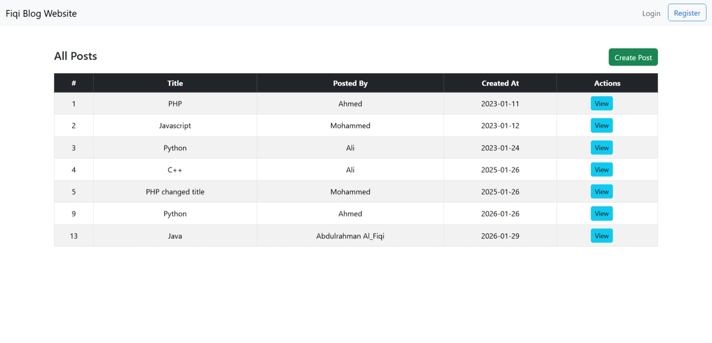
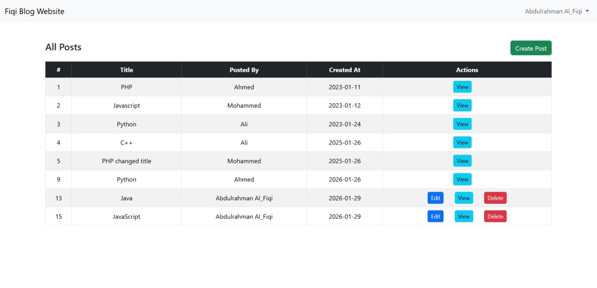
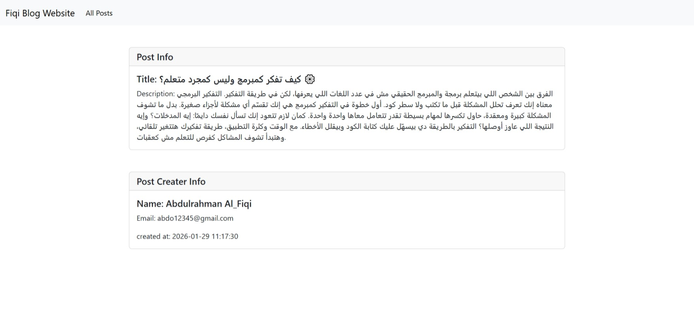
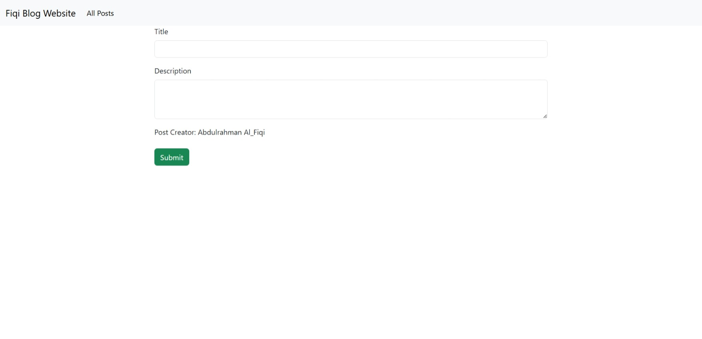
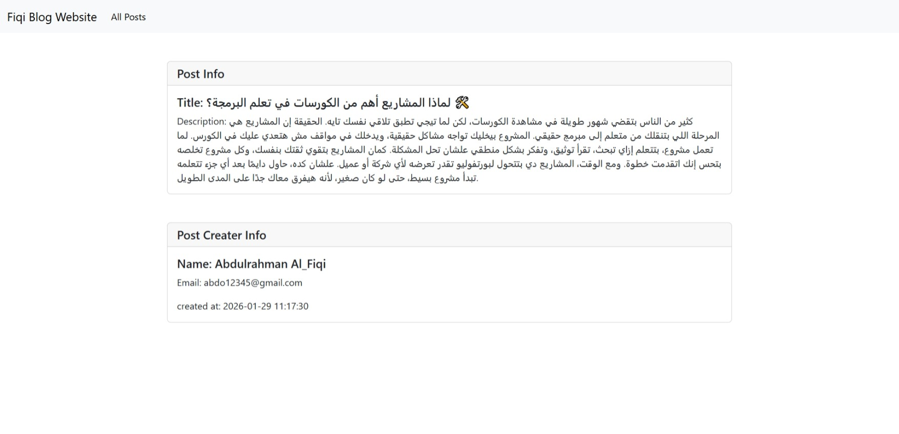
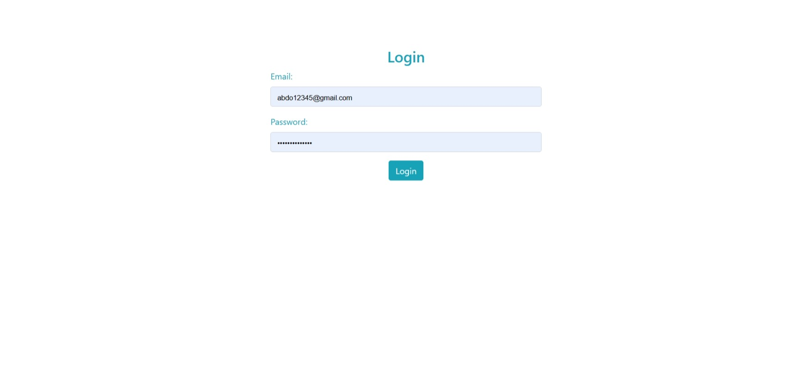

# Fiqi Blog Website 📝


---

## 🚀 Project Overview
**Fiqi Blog Website** is a simple **Laravel Blog Application** with **user authentication and authorization**.  
Users can:
- Register & Login  
- Create, Read, Update, and Delete posts  
- Only edit/delete posts they own  

This project demonstrates **manual authentication** in Laravel without using Breeze or Jetstream, making it ideal for learning.

---

## 🖼 Screenshots








> The screenshots shows the homepage with all posts listed.  
> Users can view, create, and manage posts after logging in.

---

## ✨ Features
- ✅ Manual User Registration & Login  
- ✅ Password Hashing for Security  
- ✅ Logout Functionality  
- ✅ CRUD Posts (Create, Read, Update, Delete)  
- ✅ Authorization: Users can only edit/delete their own posts  
- ✅ Blade Templating for a clean UI  

---

## 🛠 Requirements
- PHP >= 8.0  
- Composer  
- MySQL or any supported database  
- Node.js & npm  

---

## ⚡ Installation

1. **Clone the repository**
```bash
git clone https://github.com/your-username/fiqi-blog-website.git
cd fiqi-blog-website
